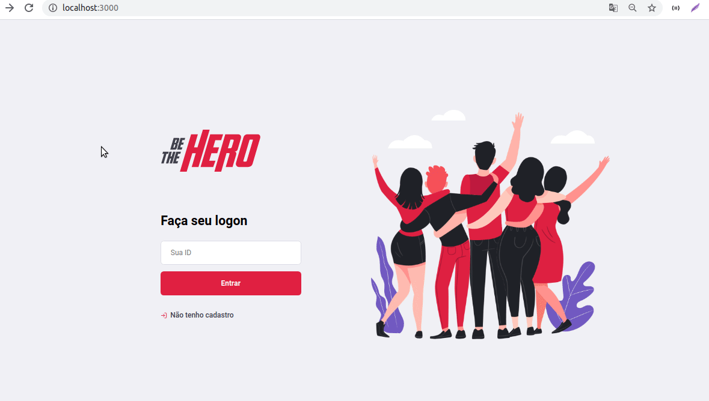

# Be The Hero

## Sobre o projeto




O projeto Be The Hero visa ajudar ONG's a cadastrar e compartilhar casos que necessitem de ajuda. Através de um sistema WEB a ONG cadastra um caso e informa o valor que precisa e outros usuários através de um aplicativo mobile podem entrar em contato por email ou whatsapp oferencendo o valor necessário.

### Construído com:
As estruturas que o projeto contempla são:
## Back-end
* Node.JS
* Nodemon
* Express
* Knex
* Sqlite3
* Celebrate
* Jest
* Supertest

## Front-end
* Reactjs
* React-router
* React-dom
* Axios

## Mobile
* React native
* Expo  
  
  <!-- GETTING STARTED -->
## Começando

Para obter uma cópia local em execução, siga estas etapas simples de exemplo.

### Pré-requisitos

Este é um exemplo de como listar as coisas necessárias para usar o software e como instalá-las.
* npm 
```sh
npm install npm@latest -g
```

### Instalação

1. Clone o repositório
```sh
git clone https://github.com/DaywisonFerreira/be-the-hero.git
```
3. Instale as dependências
```sh
npm install
```


<!-- CONTACT -->
## Contato

Daywison Leal - [LinkedIn](https://www.linkedin.com/in/daywison-ferreira-leal-ba6878127/) - daywison.leal@gmail.com

Link do Projeto: [https://github.com/DaywisonFerreira/be-the-hero](https://github.com/DaywisonFerreira/be-the-hero)
